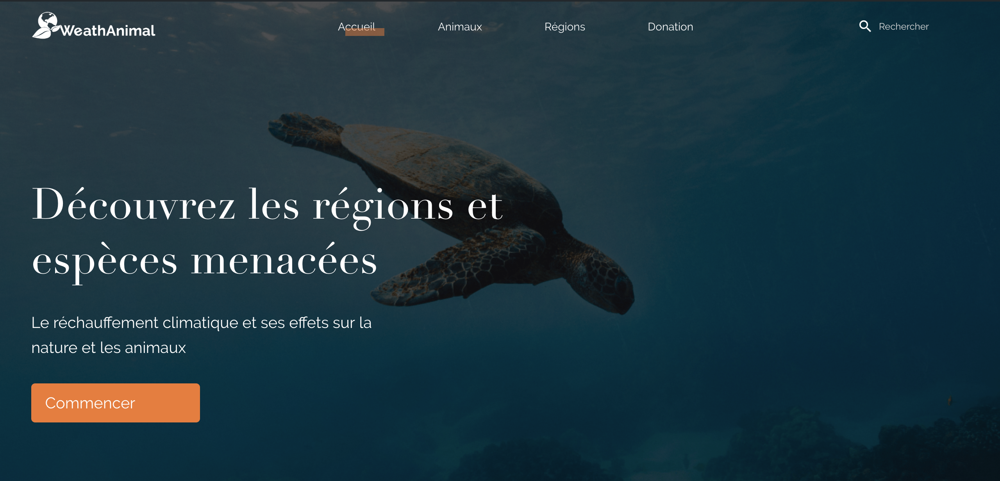

# Wordpress Project - Team 5 (H3)

## Instructions

1. Git clone the repository
2. Get the database and wp-content
3. npm install

___

## Technologies and structure

- Wordpress + Gulp + ACF
- SASS (BEM, CSS grid)
- ES6 POO
- Co-working structure (dploy + WP_Sync_DB + Git flow)

## Features
- Custom back-office (pictures, menu, texts, mouse)
<<<<<<< HEAD
<<<<<<< HEAD
- Transitions & parallax
- Ajax
- Responsive
=======
- Transitions and parallax
- Ajax 
>>>>>>> develop
=======
- Transitions and parallax
- Ajax 
>>>>>>> develop

## Future features
- Better SEO
- More modifications available from the back-office
<<<<<<< HEAD
<<<<<<< HEAD
=======
=======
>>>>>>> develop

>>>>>>> develop

## Thanks
- Grégoire Puget
